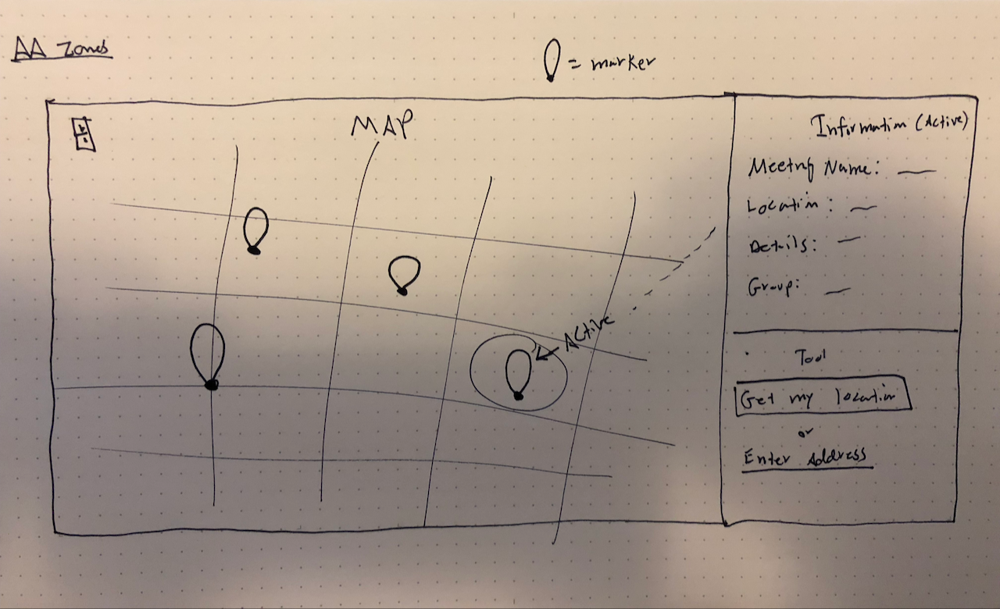
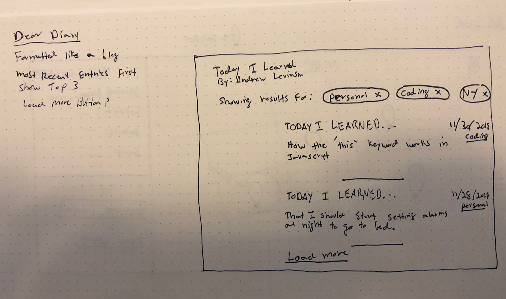
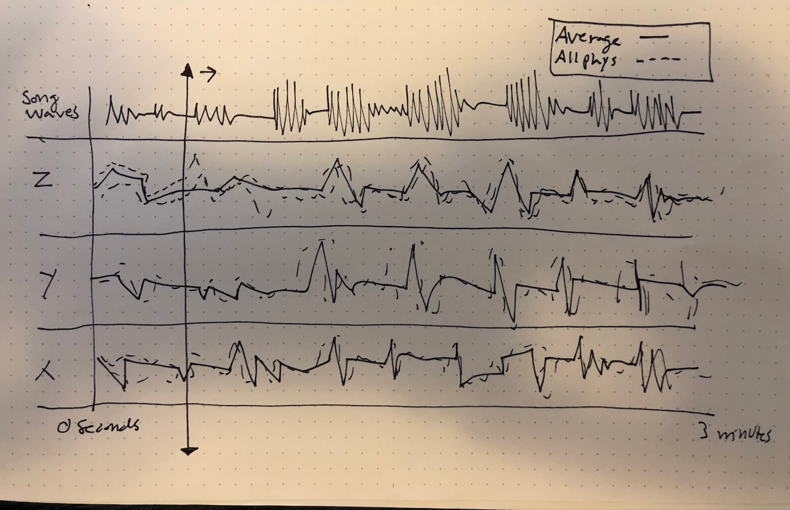

## Weekly Assignment 11

### Design Sketches for 3 Final Projects

Below, a picture of a sketch for each final concept along with the answers to the following questions.

1. What will the visualization look like? Will it be interactive? If so, how?
2. How will the data need to be mapped to the visual elements?
3. For that mapping, what needs to be done to the data? Be specific and clear. Will it require filtering, aggregation, restructuring, and/or something else? How will this be done?
4. What is the default view (if any)?
5. What assumptions are you making about the user?

---

### Project 1 – AA Zones

1. For this concept, I went with a simple layout. The map takes up about 70 percent of the screen and the information panel on the right the remaining 30 percent. A user can click on a marker and the information is displayed in the panel. I took this approach instead of a tooltip approach since there seems to be a lot of relevant information to display, and more screen real estate should be used. Additionally, in the bottom right there's a tool (may change position/layout) to get the user's current location or enter a location to see nearby meetings.
2. The markers will be placed on the map layer according to their lat/long. Each lat/long is associated with a location ID. Once a user clicks on the marker, ALL the meetings information associated with that location ID is displayed in the panel. This is critical because some locations will have multiple meetings.
3. My "times" table uses the location ID as a foreign key already, so the current structure build in week 7 should holdup. There just may need to be some additional cleaning once I start displaying information.
4. The default view will fit all of Manhattan on the users device and show all meeting locations marked. No pre-filtering is assumed until a user enters their location.
5. For this tool, I'm assuming the user wants to find a location in proximity to another location (either close to their house/work or strategically far away) so location is the primary tool given to the user and no other assumptions are made regarding time, group, etc.

---

### Project 2 – Dear Diary

1. For this concept, I'm taking a basic blog layout approach. Interactivity will come in the form of being able to change the "chips" that display the topics for the entires (personal, coding, New York)
2. One of my fields in the NoSQL table is "tag" which assigns a tag to each entry. This is also the primary key. Additionally, the text from each entry along with any media will also be displayed in each entry.
3. Filtering will be the biggest challenge. If the user updates the tags shown, I will need to reload the displayed posts to only show the active tags.
4. By default, I will show all 3 categories of tags and the most recent entry first. Once the UI starts coming together I will consider either displaying all entries that fit criteria at once, or potentially only loading the first 3 and including a "load more" button at the bottom (shown in sketch) for a more performant site.
5. Making very little assumptions about the user here as I'm by default loading all entires in all tags. It's up to the user, once the page loads, to filter to their liking. I am assuming that the most recent entry is the most important, though.

---

### Project 3 - Sensor Data

1. This is my most complex visualization and may change as I begin building. But ideally, I will attach the accelerometer to my guitar and play the same song every day, recording the x and y values throughout each play (approx 3 min per day). The visualization will map the points accross a timeline for the duration of the song. We'll be able to see if there are similar movements throughout the song during each play. The timelines points will be split between x, y, and (potentially) z. An average throughline for each variable will be present along with lighter opacity lines for every play. Since this may be fairly complex, instead of interactivity, I will simply play the song and the user can see the time-marker animate through the points. The only interactivity, if any, would be the ability to start/stop/reset the animation.
2. My sensor is recording X, Y, and Z values to the database 10 times a second each time the song is played. I will then plot each point (for which there will be about 2000) on a timeline according to the time it was observed.
3. I don't think much will need to change in the data for this to work. As long as I have X, Y, and Z values with their times I should be good. The only thing I will need to write a script for is to group each set of about 2000 values into a group so I can plot them on top of each other for each recording. Additionally, if I want the song to play I will need to load that and keep it in sync with the points as well.
4. By default, the time marker is a 0:00. Will determine if it autoplays on load or the user needs to click play manually.
5. No specific unique user assumptions – just that they are here to observe my analysis of observations for entertainment and less like a tool like the AA locations.

---
