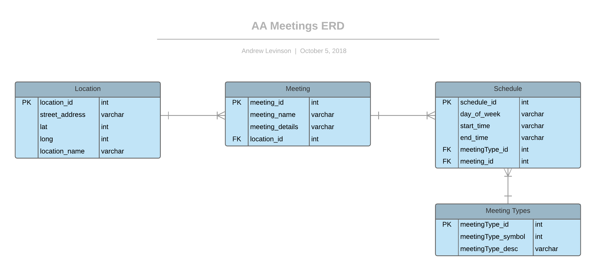
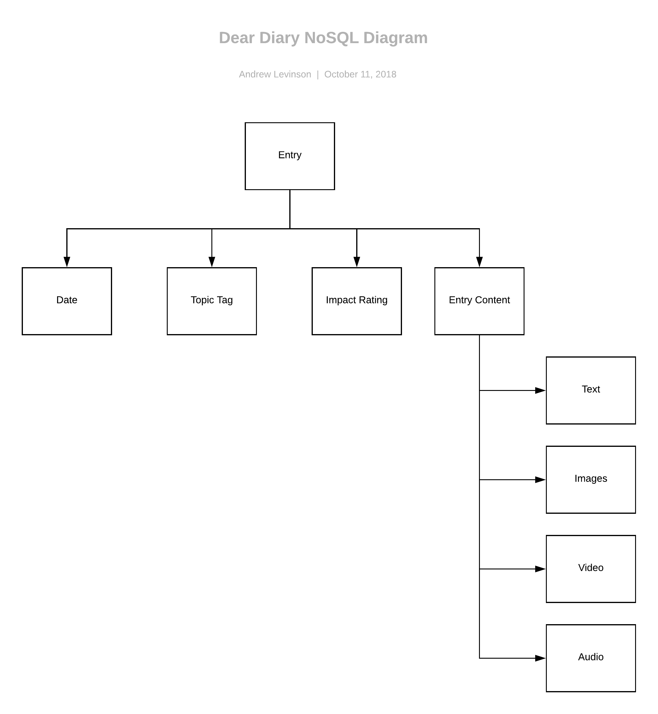

## Data Structures Final 3 Projects Process

Below I breakdown my process for building an express app for my 3 distinct final projects built with node/express and deployed using Zeit Now.

[Link to my final index page](https://data-structures-finals-qkspqllnwh.now.sh/ "Finals")

---

## 1. AA Meetings in NYC

### Final Application

[Link to Final Project](https://data-structures-finals-qkspqllnwh.now.sh/aa "Final AA Project")


### Process

This project was the most intensive in terms of cleaning and structuring the data. Throughout all of the following steps, additional cleaning was necessary to ensure accurate and well-structured data.

1. Starting with poorly structured HTML files from the AA zones site, I used the Cheerio module in node to scrape the pages and pull necessary information in the most structured way I could and push the results to a JSON file.
2. In order to plot points on a map, I needed to get the Lat/Longs of the different AA locations. I used the address strings in my JSON file and connected to the TAMU geolocations service. I then took the response and selectively pushed the address, lat, and long values to an array of objects for each unique location.
3. Next, I determined this data fits best in a SQL structure and decided to use AWS RDS (PostgreSQL) database. I first designed a diagram to determine the tables and keys best suited for my data.



4. Once I had my design, I needed to create and insert the data into the db tables. This part was most difficult. I needed to parse through all the data in all zones of the AA meetings (for this part I worked with a team and split up the work) in order to scrape the relevant information. To see the guts of this operation refer to my scripts in my [week 6](../6-weekly-assignment) and [week 7](../7-weekly-assignment) folders.

5. Finally it was time to build the app. First, I wanted to write the SQL query to test and mold the endpoint to pull the data in a usable format for my app. See the query below:

```SQL
SELECT addresses.street as address, addresses.zipcode as zip, addresses.lat as lat, addresses.long as long, addresses.addresspk as addressUnique, locations.name as location, locations.details as details, specialinterest, groups.name as groupname, wheelchairaccess as wheelchair, groups.scheduledetails as scheduledetails, json_agg(json_build_object('day', day, 'starttime', starttime, 'endtime', endtime)) as meetings
    FROM times
        JOIN meetings ON times.datepk=meetings.datefk
        JOIN locations ON meetings.locationfk=locations.locationpk
        JOIN groups ON meetings.groupfk=groups.grouppk
        JOIN addresses ON locations.addressfk=addresses.addresspk
        WHERE lat <> 0 and long <> 0

GROUP BY addressUnique, address, zip, location, groupname, specialinterest, details, scheduledetails, wheelchair
ORDER BY addressUnique
```

This query (after much trial and error) structured my data the best way in order to write the front end.

6. To create the app, I used node/express which builds using template literals to create an html document and inserts the data array that the query returns into a variable that the script has access to in order to build the front end.

### Front End

- Using Leaflet for the map, I first get the users current location (if error, then just use Manhattan view), then populate the map with markers for each unique location based on the lat/longs in the data.
- When a user selects a marker, then the information about the meetings at that location populate in the panel on the right side.

# 2. Dear Diary Blog [Today I Learned]

#### Final Application

[Link to Final Project](https://data-structures-finals-qkspqllnwh.now.sh/deardiary "Final DD Project")


### Process

The process for the diary blog was definitely more simple than the AA project. This blog simply shows my diary entries related to things I learned that day. The entries all have a single topic (NYC, Personal, or Coding).

1. First determined how to structure the data in a NOSql database, using DynamoDB in the AWS infrastructure. Here's my diagram:



2. After I had my structure, I then created a "table" to hold the data with the tag/topic name as my primary key. Additional information includes: entry text, date, and rating. Once it was setup I would periodically run a script to push new entries to the database.

3. The query. My original query looked like this:

```javascript
var params = {
  TableName: "deardiaryrevised",
  KeyConditionExpression: "#tp = :topicName", // the query expression
  ExpressionAttributeNames: {
    // name substitution, used for reserved words in DynamoDB
    "#tp": "tag"
  },
  ExpressionAttributeValues: {
    // the query values
    ":topicName": { S: "coding" }
  }
};
```

However, once I started building the app, and thinking about the design, I realized I would want access to ALL the entries for the user to navigate. By default, a user sees a chronological list of entries for all topics with the ability to click between specific topic tags. Because of this, I determined that a "scan" of DynamoDB instead of a proper query best fit my app.

```javascript
dynamodb.scan(params, function(err, data) {
  if (err) {
    console.error("Unable to query. Error:", JSON.stringify(err, null, 2));
  } else {
    var resp = oneDD + JSON.stringify(data.Items) + twoDD;
    //   res.send(data.Items);
    res.send(resp);

    console.log("3) responded to request for dear diary data");
  }
});
```

See above that I'm using `dynamo.scan` to return all results and the filtering is done on the front end with javascript.

This approach makes more sense to me because I don't necessarily want users controlling my database queries from the front end, and using array methods (like Array.filter and Array.map) would be much faster than re-querying and re-building the app everytime a user changes views.

### Front End

- By default, a user sees the blog with All Topics showing and entries starting with most recent.
- When a user clicks a specific topic tag from the topic list, I filter the data to return results only for that topic and re-write the innerHTML with basic javascript.

# 3. Sensor Project [Maping Motion to Music]

#### Final Application

[Link to Final Project](https://data-structures-finals-qkspqllnwh.now.sh/ss "Final DD Project")


### Process

Often we see music visualized through waveforms and decibel levels, but what about the physical motion of playing the music? Using an accelerometer attached to the head of my guitar, I tracked the X-Value and Y-Value of the instrument while I played "Killing in the Name Of" by Rage Against the Machine. In my visualization, you can hover over the points on the line graph and hear that clip of the song.

1. First, I needed to setup the sensor with Particle by writing a script that writes the sensor values to a variable 100 times a second.
2. Then I setup a PM2 instance in AWS in order to pull the sensor variable, parse it, and write the x and y values of the sensor to a PostgreSQL database table. (xvalue, yvalue, time)
3. In order to be in sync with a song, I would turn the PM2 instance on and start the song at the exact same moment, play along for the full 5 minutes, then stop PM2 to stop writing values. Since I never recorded more than 1 take per day, I could rely on each days worth of values to be from a single tracking.
4. The query. In order to setup my data like I needed it, I extracted parts of the exact time each value was recorded:

```SQL
SELECT EXTRACT(DAY FROM sensortime) as recordingday, EXTRACT(SECOND FROM sensortime) as sensorsecond, xValue, yValue, zValue

             FROM sensordata
             GROUP BY recordingday, sensorsecond, xValue, yValue, zValue
             ORDER by recordingday, sensorsecond;
```

5. Before I could plot the values on a line graph with D3.js, I needed to sync up the song with the recorded values. I have to write a function to find the smallest value, and convert it to "0" seconds in order to calibrate the following values:

```javascript
// find smallest minute
let minMin = d3.min(data, d => {
  return d.sensorminute;
});
let indexMin =
  data.indexOf(
    d3.min(data, d => {
      return d.sensorminute;
    })
  ) + 1;
// find second of smallest minute
let minSec = data[indexMin].sensorsecond;

// starting moment
let uniqueMin = minMin * 60 + minSec;

// create unique value based on time to visualize data linearly
data.forEach(el => {
  el.uniqueMoment = parseFloat(
    el.sensorminute * 60 + el.sensorsecond - uniqueMin
  );
});
```

The above code creates a "unique moment" which is the total seconds since the hour started, in order to convert the exact time recorded until.

### Front End

- I was able to load in the .m4a file for the song using the Howler.js library (makes working with sound in JS easier) and sync it to the values in the data
- Using D3.js to plot the line graph, each circle can be hovered on to reveal the moment of the song that guitar position was recorded, as well as the X and Y values at that moment. Additionally, a 5-second clip of the song plays as well for context.
